# OpenWeatherMap API to RDS Postgres database table in parallel with CSV file in S3 bucket load to database table; then join and save to S3 and copy to BigQuery ETL Pipeline by Airflow on EC2
This is my third industry-level ETL project. This data pipeline orchestration uses Apache Airflow on AWS EC2. 

It demonstrates how to build an ETL data pipeline that would perform data extraction to a database in parallel to a loading process into the same database, join the tables, copy joined data to S3 and finally copy the S3 file to BigQuery DW.
<br><br>

## GENERAL OVERVIEW OF PROJECT
This basic BI Engineering project which I did demonstrates the process of how to extract the current weather information for Houston city from the Open Weather Map (OWM) API (https://openweathermap.org/), used python to perform data transformation, loaded the resulting data into a prepared table in an RDS Postgres database, and while this is happening, an existing CSV file in an S3 bucket is being copied into another table in the same Postgres database. 

The orchestration goes on to perform a SQL join on these two tables in RDS then the resulting data is dumped as CSV file into the S3 bucket. 
Finally, the data from this new CSV file is copied into a prepared BigQuery data warehouse. 
This ETL pipeline (work flow) was orchestrated and scheduled using Apache airflow running in an AWS EC2 instance. 

Apache Airflow is an open-source platform used for orchestrating and scheduling workflows of tasks and data pipelines.

The project covers the fundamental concepts of Apache Airflow such as DAG (Directed Acyclic Graph) and Operators, and it shows how to schedule the ETL pipeline especially for parallelized tasks. 
It begins with extracting JSON format data from the API, and then transforming it into CSV format while applying some logic and calculations on the dataset. 
More importantly, it demonstrates how to integrate Amazon RDS Postgres database and BigQuery data warehouse into an ETL workflow in the simplest way possible (though arguably not the most robust way).
<br><br>

## PROJECT REQUIREMENTS
1. Fundamental knowledge of SQL, Python, CSV/JSON, AWS IAM, Apache Airflow, DW & ETL concepts
2. Basic knowledge of GCP especially BigQuery for data warehousing as well as Google Cloud IAM
3. Familiarity with fundamentals of Postgres database especially in Amazon RDS environment
4. OpenWeatherMap.ORG free account with API key (to serve as the data source)
5. AWS EC2 instance with at least 4 GB memory (t3.medium) Ubuntu; and AWS S3 bucket as Data Lake
6. Code Editor (I used VSCode) for connecting to EC2 instance to create code (DAG file) on Airflow
7. Apache Airflow for orchestration (authoring of the ETL workflow via DAG) & services connections
8. Perseverance to troubleshoot and resolve errors and failures, read logs, rebuild components, etc
<br><br>

## STEPS OF THE WORKFLOW
The following account of the project development process is not enough to enable the reader code along or replicate the whole process from start to finish. 
For instance, there is no detailing of the steps involved in creating accounts with Google Cloud, OpenWeatherMap, and Amazon AWS. 
There is also no detailing of the steps in creating S3 bucket, setting up RDS Postgres database instance, spinning up the AWS EC2 instance from scratch and preparing it to work with Airflow (Firewall settings for HTTP/HTTPS/SSH and attaching the IAM Role), connecting VSCode to the EC2 instance, as well as accessing Airflow via web browser.

However an experienced and capable Data Engineer should be familiar with how these are set up, but the reader who is not knowledgeable in these areas is hereby encouraged to do their own research, enrol in a Data Engineering bootcamp or learn from data engineering tutorials available online on some websites or some great channels on YouTube, or reach out to me for clarification. With that out of the way, let’s go over the key steps in this project.

Having satisfied all the 8 requirements in the preceding section, I proceeded to carry out the following setup:
<br><br>

### STEP 1: Created the S3 Bucket, then created an IAM User and gave it S3FullAccess permission. Took note of the following relevant details:
* S3 bucket name: us-city-weather-data-etl-pipeline-data-lake
* Block Public Access: Keep all options enabled
* Disable bucket key
* Organized S3 bucket properly, and upload the “us_cities.csv” file to the “raw_data/” directory in the bucket. See the file [here](codes/us_cities.csv):

```
us-city-weather-data-etl-pipeline-data-lake/
   |
   |── raw_data/                      # Stores incoming CSV files
   |      |                                 
   |      |── us_cities.csv              # To be manually uploaded to this S3 bucket folder
   |      |                         
   |── processed_data/                # Stores cleaned/joined data
   |      |                          
   |      |── final_weather_data.csv     # The joined data that would be copied to BigQuery
```

Screenshots showing the contents of the prepared S3 bucket data lake environment:


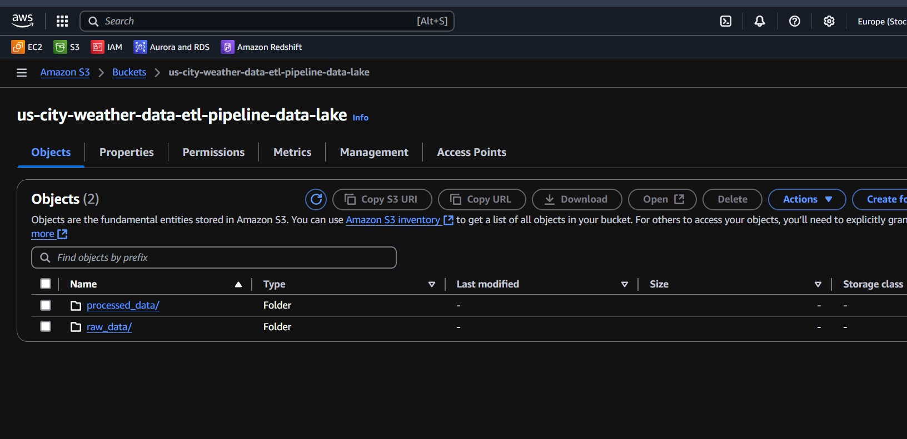
<br>

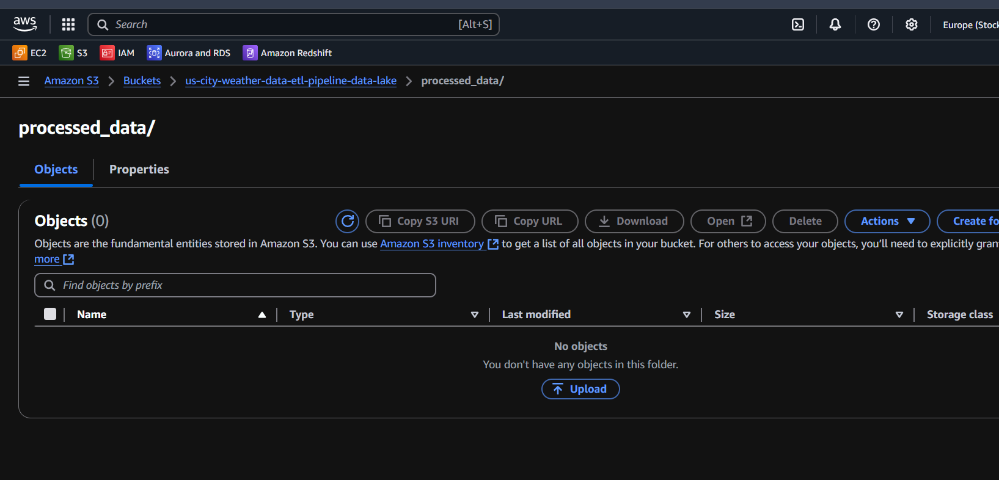
<br>

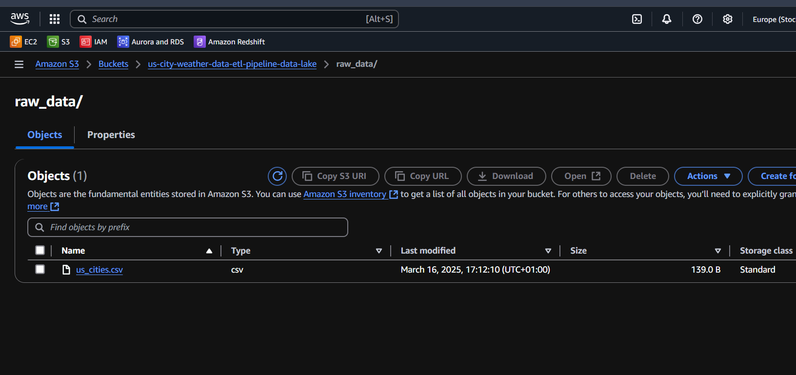
<br>


### STEP 2: Prepared the BigQuery DW environment (Logged in to Google Cloud > Console > New Project > Enable BigQuery API > BigQuery Studio)

#### a) Created the dataset, i.e. schema (“weather_datawarehouse”) in the new project (us-city-weather-data-warehouse):

```
CREATE SCHEMA IF NOT EXISTS `us-city-weather-data-warehouse.weather_datawarehouse`;
```


<br>

#### b) Created the destination table (final_weather_data) in the schema (“weather_datawarehouse”) :

```
CREATE TABLE IF NOT EXISTS `us-city-weather-data-warehouse.weather_datawarehouse.final_weather_data` (
    city STRING,
    state STRING,
    description STRING,
    temperature_fahrenheit FLOAT64,
    feels_like_fahrenheit FLOAT64,
    min_temperature_fahrenheit FLOAT64,
    max_temperature_fahrenheit FLOAT64,
    pressure INT64,
    humidity INT64,
    wind_speed FLOAT64,
    time_of_record TIMESTAMP,
    sunrise TIMESTAMP,
    sunset TIMESTAMP,
    census_2020 INT64,
    land_area_sq_mile_2020 FLOAT64
);
```


<br>

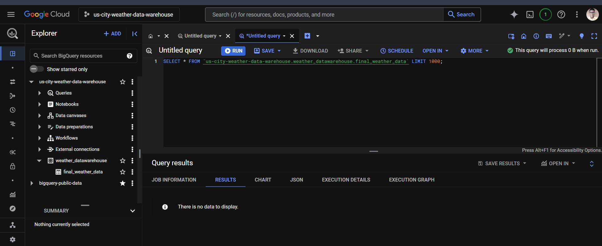
<br>

#### c) Enabled EC2 access to BigQuery by creating a Service Account with a Google IAM role that allows DDL and DML activities. 
This gave a JSON service key that I transferred to the EC2 instance to be called upon by the DAG file later.
<br><br>

### STEP 3: Created RDS Postgres database with the following details:

DB name: `us-city-weather-data-etl-pipeline-database`
Master username (login): `postgres`
Master password: `myRDSpassword`
Endpoint (hostname): `us-city-weather-data-etl-pipeline-database.cro6gemmugwm.eu-north-1.rds.amazonaws.com`

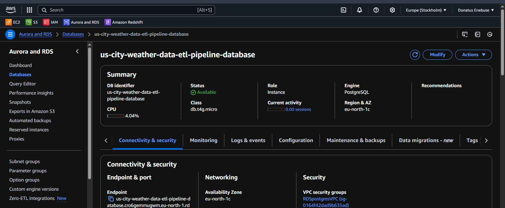
<br>

This database environment would be properly set up later in step 5.
<br><br>	

### STEP 4: Set up the EC2 environment by provisioning a t3.medium Ubuntu instance

#### a) Added a Security Group to allow specific traffic. 
Inbound SSH (port 22) for VSCode, HTTP (port 8080) for Airflow, HTTPS (port 443) for API calls/response and GCP authentication, PostgreSQL (port 5432) for RDS Postgres. 
Outbound All Traffic Anywhere (0.0.0.0/0) (to allow outgoing connections to S3, RDS, and BigQuery).


<br>

#### b) Did necessary installs on the EC2 to prepare it for Airflow:

##### Updated the system packages
```
sudo apt update && sudo apt upgrade -y
```
##### Then installed required system dependencies
```
sudo apt install -y python3-pip python3.12-venv
```
##### It's best to install Airflow inside a virtual environment to prevent conflicts
```
python3 -m venv api_s3file_rds_s3_bigquery_airflow_eC2_env
```
```
source api_s3file_rds_s3_bigquery_airflow_eC2_env/bin/activate
```
##### Installed Apache Airflow for DAG authoring and to define Python tasks (DAG, airflow.operators.python, airflow.models)
```
pip install apache-airflow
```
##### Installed HTTP Provider (For API Calls & HttpSensor)
```
pip install apache-airflow-providers-http
```
##### To make API calls (OpenWeatherMap) and Work with CSV data 
```
pip install requests pandas
```
##### To nteract with Postgres DB (psycopg2)
```
pip install psycopg2
```
##### To interact with Google BigQuery (google.cloud and google.oauth2)
```
pip install google-cloud-bigquery
```
##### Installed AWS CLI (For S3 & IAM Role Management)
```
pip install awscli
```
##### For S3 interaction (without boto3)
```
pip install s3fs
```
##### Installed PostgreSQL Client (For interacting with RDS via CLI in VSCode)
```
sudo apt install postgresql-client
```
<br>

#### c) Added the OpenWeatherMap API Connection via the bash terminal: Used to extract weather data from OpenWeatherMap API.
```
airflow connections add 'weather_api_new_conn' \
    --conn-type 'http' \
    --conn-host 'https://api.openweathermap.org/data/2.5' \
    --conn-extra '{"api_key": "59250d7y8k082p9023ij683t478rnvxt"}'
```

#### d) Set important credentials via the bash terminal to be called dynamically later by the DAG file
```
airflow variables set openweather_api_key "59250d7y8k082p9023ij683t478rnvxt"
```
```
airflow variables set rds_host "us-city-weather-data-etl-pipeline-database.cro6gemmugwm.eu-north-1.rds.amazonaws.com"
```
```
airflow variables set rds_password "myRDSpassword"
```
<br><br>

### STEP 5: Logged into the RDS Postgres via CLI (VSCode) and created tables

#### a) Test RDS from EC2 using Netcat
```
nc -zv us-city-weather-data-etl-pipeline-database.cro6gemmugwm.eu-north-1.rds.amazonaws.com 5432
```

#### b) Connected to DB instance (run this command and enter password)
```
psql -h us-city-weather-data-etl-pipeline-database.cro6gemmugwm.eu-north-1.rds.amazonaws.com -U postgres
```

#### c) List databases
```
\list
```
or
```
SELECT datname FROM pg_database;
```

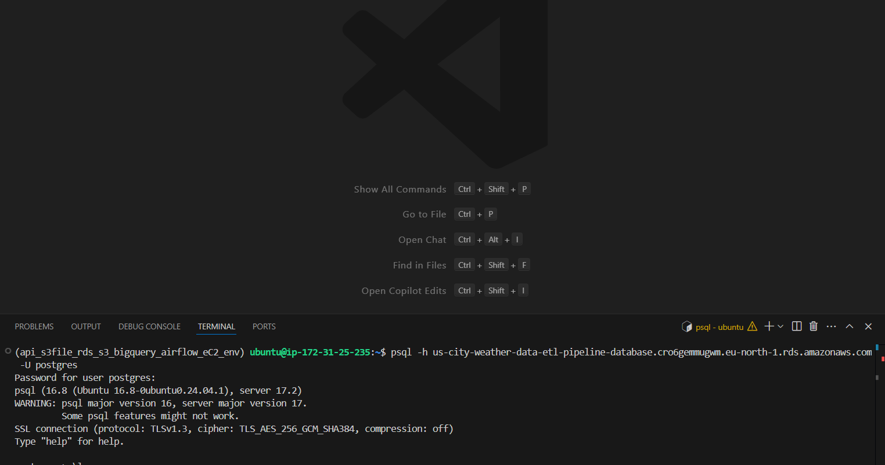
<br>

#### d) Created new DB 
```
CREATE DATABASE us_city_weather_db;
```

#### e) Connected to the DB
```
\c us_city_weather_db
```

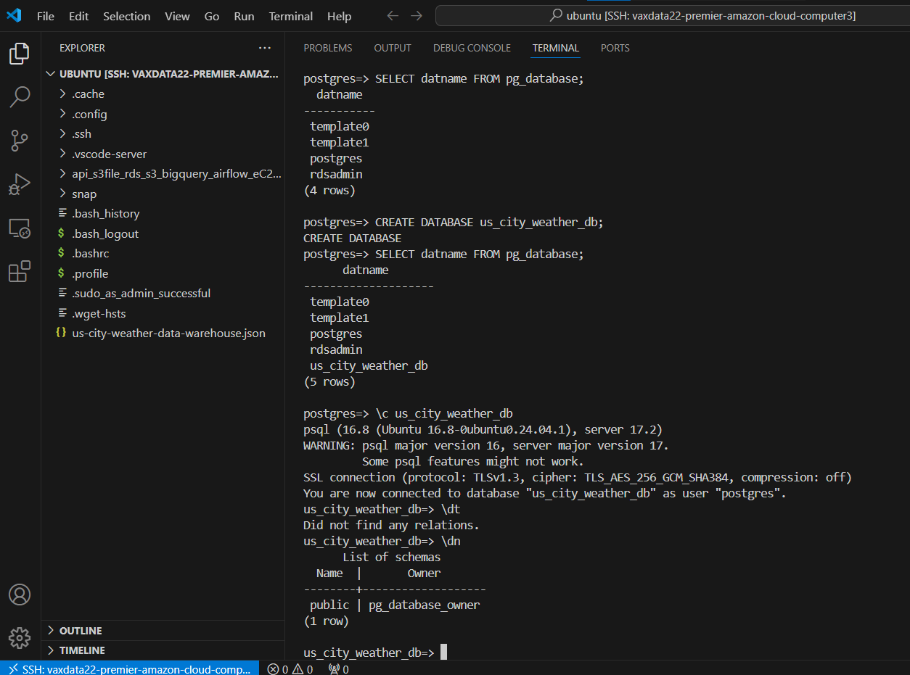
<br>

#### f) To see the schema
```
\dn
```

#### g) To see the tables
```
\dt
```

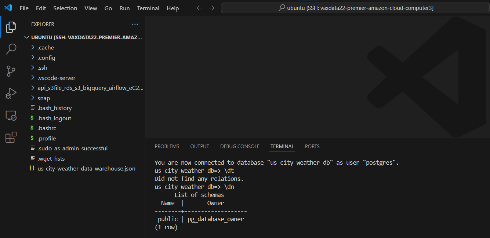
<br>

#### h) Created the two required tables:
```
CREATE TABLE IF NOT EXISTS houston_weather_data (
    id SERIAL PRIMARY KEY,
    city TEXT NOT NULL,
    description TEXT,
    temperature_fahrenheit FLOAT,
    feels_like_fahrenheit FLOAT,
    min_temperature_fahrenheit FLOAT,
    max_temperature_fahrenheit FLOAT,
    pressure INT,
    humidity INT,
    wind_speed FLOAT,
    time_of_record TIMESTAMP,
    sunrise TIMESTAMP,
    sunset TIMESTAMP
);

CREATE TABLE IF NOT EXISTS city_look_up (
    id SERIAL PRIMARY KEY,
    city TEXT NOT NULL,
    state TEXT NOT NULL,
    census_2020 INT,
    land_area_sq_mile_2020 FLOAT
);
```

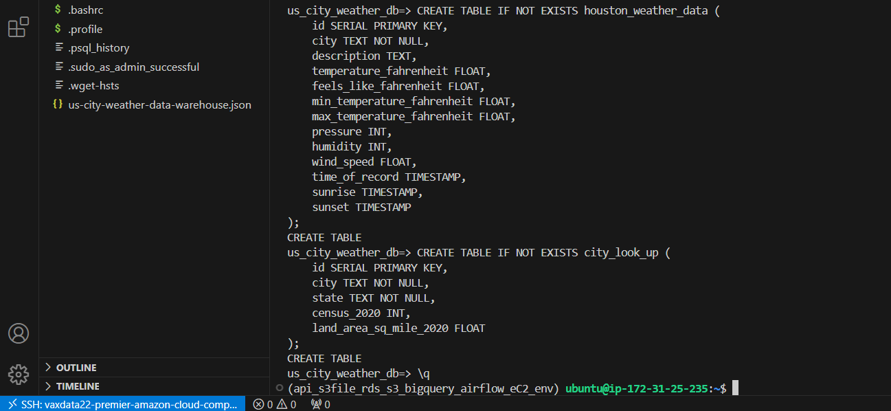
<br>

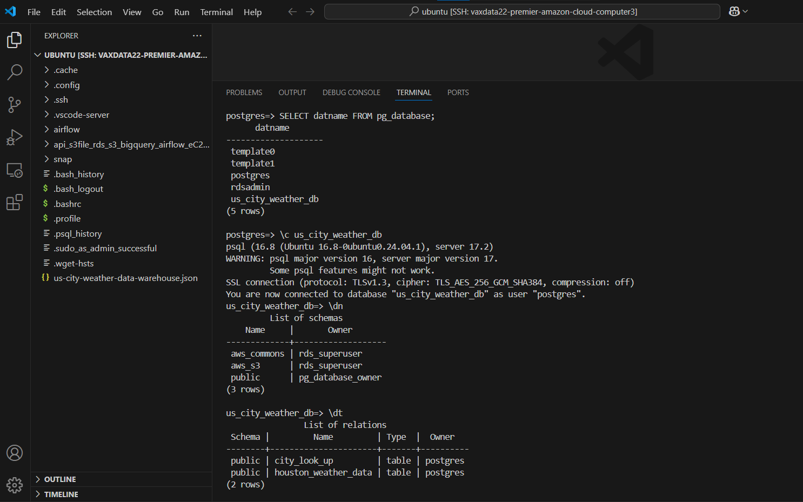
<br>

### STEP 6: Authoring the orchestration DAG and testing:

The first step was to examine the JSON data received from the API endpoint when an HTTP call was made to it:
```
https://api.openweathermap.org/data/2.5/weather?q=portland&appid=59250d7y8k082p9023ij683t478rnvxt
```
```
{
  "coord": {
    "lon": -95.3633,
    "lat": 29.7633
  },
  "weather": [
    {
      "id": 800,
      "main": "Clear",
      "description": "clear sky",
      "icon": "01d"
    }
  ],
  "base": "stations",
  "main": {
    "temp": 293.1,
    "feels_like": 292.82,
    "temp_min": 291.99,
    "temp_max": 294.34,
    "pressure": 1027,
    "humidity": 64,
    "sea_level": 1027,
    "grnd_level": 1024
  },
  "visibility": 10000,
  "wind": {
    "speed": 4.12,
    "deg": 160
  },
  "clouds": {
    "all": 0
  },
  "dt": 1742224290,
  "sys": {
    "type": 2,
    "id": 2001415,
    "country": "US",
    "sunrise": 1742214515,
    "sunset": 1742257853
  },
  "timezone": -18000,
  "id": 4699066,
  "name": "Houston",
  "cod": 200
}
```
<br><br>

Building on experience and knowledge from my previous ETL project ([see it here](https://github.com/vaxdata22/Cities-Weather-S3-Snowflake-Slack-notif-ETL-by-Airflow-on-EC2/tree/main), I found the “extract from API” and “load to S3” tasks (as well as other tasks) to be pretty straightforward as they are based on how to use the relevant Operators in Airflow. This part was done by connecting my VS Code to the EC2 instance running Airflow then doing the coding of the DAG over there. 


<br>

In between, I would test run the DAG via the web browser (and this requires stopping and restarting Airflow via the CLI). All aspects of the orchestration were tested, including the DAG run failure and retry. See the finished Airflow orchestration DAG Python file [here](codes/weather_etl_pipeline.py).


<br>

Once the DAG was finished, I triggered the DAG via the Airflow UI on the web browser, and observed how the orchestration was successful. 

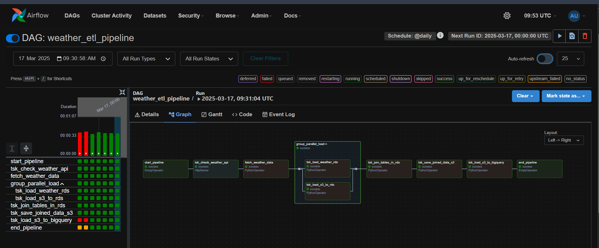
<br><br>

### STEP 7: Verifying the success of the ETL orchestration:
Upon the success of the orchestration, I verified the ETL process through the following:

#### 1) Checked the S3 bucket and its contents to see that the “processed_data/” folder which was formerly empty now contained a CSV file named “final_weather_data.csv”. This was contained the Houston weather data that was extracted from the OpenWeatherMap API.

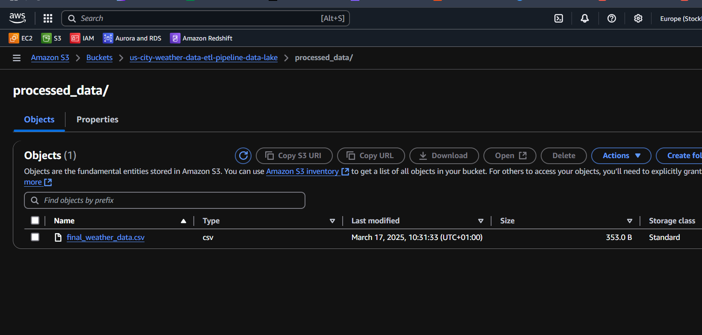
<br>

#### 2) Queried the RDS Postgres DB tables using a Python Notebook environment (Google Colab). Find the IPYNB file [here](/codes/RDS_Postgres_testing.ipynb). By the way, I ran into issues with using pgAdmin for this. It was observed that the two tables that were empty now contained data.

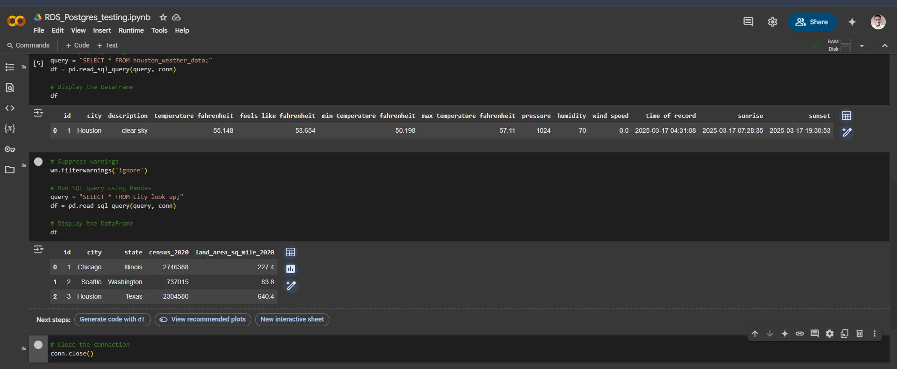
<br>

#### 3) Queried the BigQuery DW destination table to see that the data from the joining of the RDS tables has now been copied into the BigQuery destination table correctly.

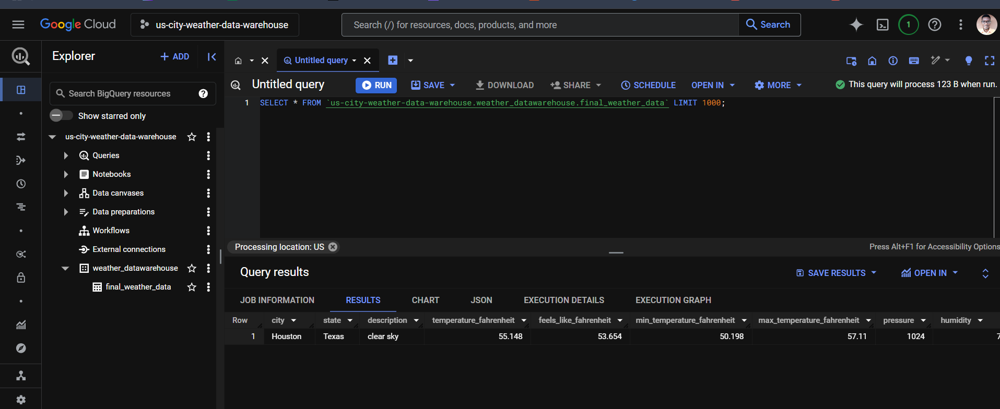
<br>

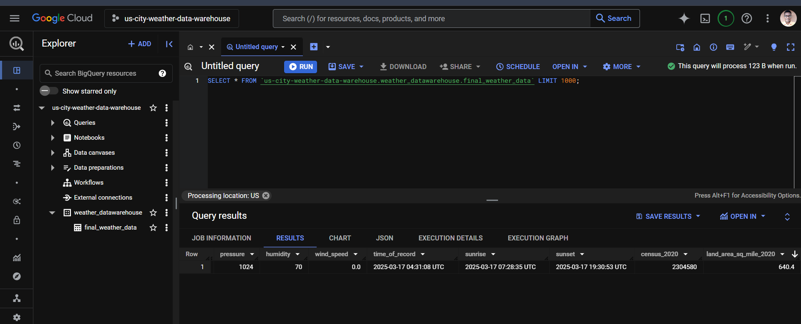
<br><br>

### STEP 8: Teardown and conclusion of demonstration:
Since this was for demonstration purposes, upon the success of the project the following were done as teardown: 

* Deactivated my OpenWeatherMap API key, stopped my AWS EC2 instance, and cleared the S3 bucket that was used in the project
* Deleted the RDS Postgres DB and Shutdown the BigQuery project. Deleted the IAM role of the EC2 as well.
<br><br>

## CHALLENGES AND FINAL THOUGHTS:
Along the line, I faced issues arising from a failed import of PostgresOperator function from the airflow.providers.postgres.operators.postgres library as well as the PostgresHook function from the airflow.providers.postgres.hooks.postgres library. 
This was because there was a problem with installation of the apache-airflow-providers-postgres package. 
This problem prevented me from using the PostgresOperator and PostgresHook functions to handle the RDS database aspect in my DAG orchestration. 
I had to use PythonOperator function alongside the psycopg2 module in creating a custom python function to handle this.

Again, I faced issues arising from a failed import of SimpleHttpOperator function from the airflow.providers.http.operators.http library. 
This was similarly because there was a problem with the installation of the apache-airflow-providers-http package. 
This problem apparently did not affect the integrity of the airflow.providers.http.sensors.http library (HttpSensor) which is a part of the package. 
However this problem prevented me from using the SimpleHttpOperator function to handle the data extraction phase in my DAG orchestration. 
I had to use PythonOperator function alongside the requests module in creating a custom python function to handle this.

Once more, I faced issues arising from a failed import of S3Hook function from the airflow.providers.amazon.aws.hooks.s3 library. 
This was because there was a problem with installation of the apache-airflow-providers-amazon package. 
This problem prevented me from using the S3Hook function to handle the S3 bucket aspect in my DAG orchestration. 
I had to use PythonOperator function alongside the s3fs module in creating a custom python function to handle this. 

Finally, BigQueryHook function (from airflow.providers.google.cloud.hooks.bigquery) also did not work for my project but kept throwing series of errors that would complicate the project if I wanted to resolve them. 
I can’t say if the installation of apache-airflow-providers-google was properly done or not. 
So I simply used the bigquery function (from google.cloud) alongside the service_account function (from google.oauth2) to handle the BigQuery aspect of the orchestration.

For these four problems, I intend to do more findings as to the reason why they occurred and how to better resolve them. 
As a result of these problems, I only needed to create just one Airflow connection (the OpenWeatherMap API HTTP connection). 
Originally, I intended to in addition create and make use of AWS connection, RDS Postgres connection, and BigQuery connection.

I also understand that the DAG orchestration might not meet certain development best practices, such as not making use of Airflow providers for BigQuery, RDS Postgres, and AWS, as well as Airflow connections in the DAG file. 
In future projects, these grey areas would be addressed properly as I continue to learn more in my BI Engineering journey.

From project ideation, planning, development, testing, and deployment took me eight (4) working days because as a self-taught BI Developer, this was my first AWS Cloud Data Engineering project that is based on Airflow, EC2, S3, RDS, and BigQuery. The project could have taken me two or three days of not that I spent a good deal of time fiddling with the non-cooperative Airflow provider functions.

#### Thank you for going through this project with me!
